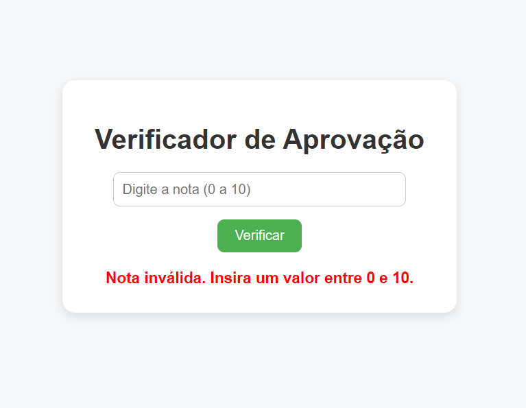

# 📝 Verificador de Aprovação 📊

Olá! 👋  
Este é um projetinho simples (mas honesto!) feito em **HTML**, **CSS** e **JavaScript**, para treinar e mostrar meus primeiros passos no mundo do desenvolvimento web. 😄

## 💡 O que faz?

Você digita uma nota (de 0 a 10), clica em "Verificar" e recebe uma mensagem dizendo se foi **aprovado**, está de **recuperação**, ou se... bom... 💔 **reprovou**. Tudo com jeitinho e cores para não doer tanto.

### 📸 Preview

  

---

## 🛠️ Tecnologias usadas

- **HTML** – a estrutura.
- **CSS** – o estilo com muito carinho.
- **JavaScript** – a mágica por trás da decisão (sem juiz, mas com lógica).

---

## 🤓 Objetivo

Este repositório foi criado como parte da minha jornada de aprendizado. Estou praticando:
- Separar HTML, CSS e JS
- Usar eventos com `onclick`
- Validar campos e dar feedback visual
- E claro... começar a usar o GitHub como gente grande 😎

---

